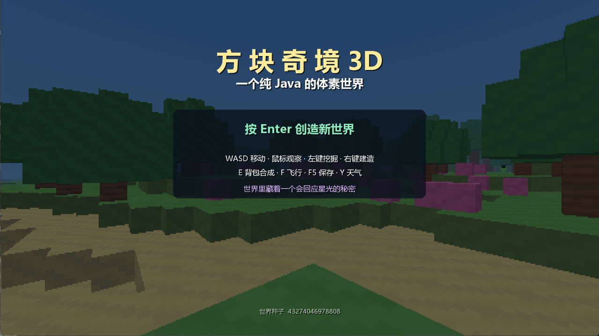
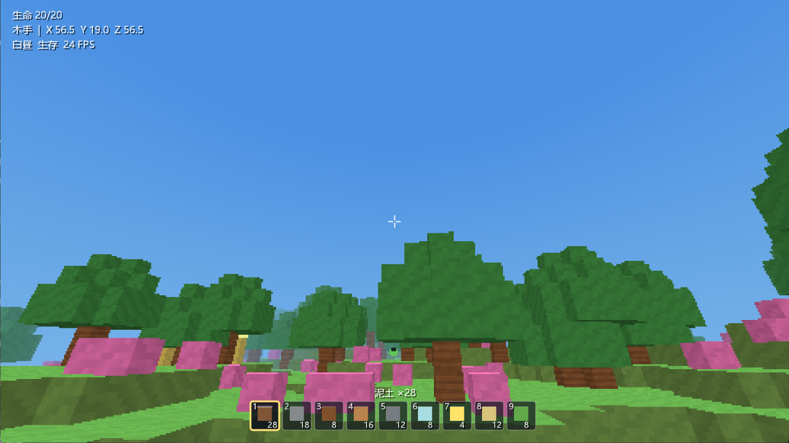
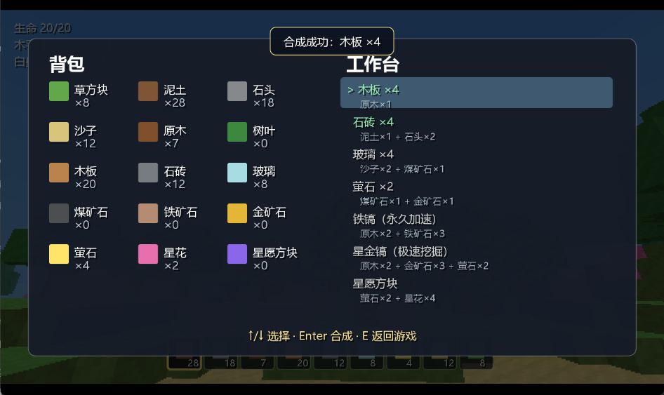
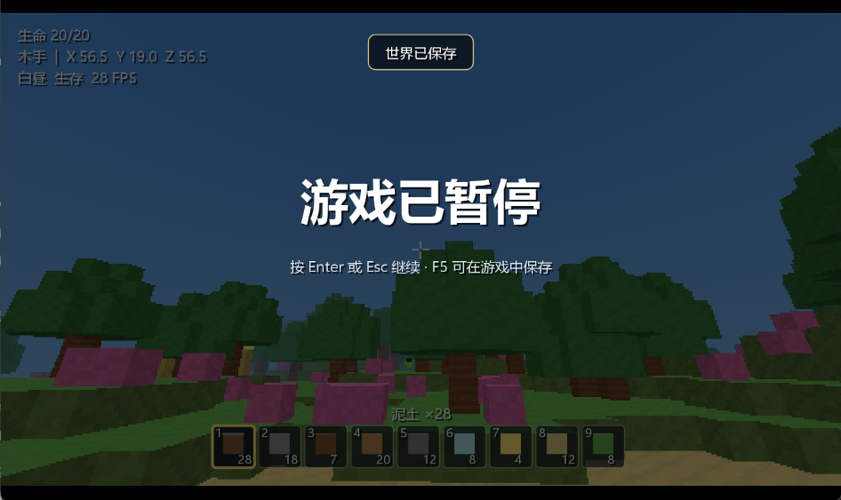

# 修复优化验证证据

日期：2026-10-06。执行者：主会话；没有独立 tester。

## 最终验证

| 验证 | 命令/方法 | 实际结果 |
| --- | --- | --- |
| 自动回归 | `powershell.exe -NoProfile -ExecutionPolicy Bypass -File test.ps1` | 退出 0，23 组通过，含放置/采集/长按战斗/世界底边界 |
| 构建 JAR | `powershell.exe -NoProfile -ExecutionPolicy Bypass -File build.ps1` | 退出 0，生成 `dist/MyWorld3D.jar` |
| 打包桌面冒烟 | `java -Dfile.encoding=UTF-8 -cp "dist/MyWorld3D.jar;out/test" com.myworld3d.DesktopSmoke .codex/team-runs/2026-10-06-repair-archive/evidence` | 退出 0，菜单、真实鼠标旋转/回中、背包、合成、失焦、保存、关闭通过 |
| 原档保护 | 比较 `saves/world.mw3d` 与 `archive/saves/world.mw3d` | SHA-256 一致，原档可用最终 loader 读取 |
| 图像检查 | 实际 AWT Robot 截取游戏画布 | 菜单、1280 游戏、960 窗口背包、暂停图像检查；7 配方及操作提示无重叠 |

实际环境：Windows、JDK 25.0.2，Java 源码以 `--release 17 -encoding UTF-8` 编译。Windows PowerShell 5.1 与当前 PowerShell 脚本均已实际运行。

## 测试覆盖

原六组：确定性生成、DDA 命中/距离/法线、遗迹、合成升级、存档往返、渲染非空帧。

新增十七组：地下矿石生成、12 种子干燥出生与世界尺寸、地表缓存失效、水下显示与采集、高空射线、分页快捷栏、库存数值边界、满库存合成、鼠标捕获与焦点、连续游泳与碰撞、伙伴唯一性与掉落、CRC/备份/非法数据/截断、v1/v2 与实际旧世界、游戏状态/新世界备份、坏档恢复、面边框、集成放置/采集/战斗/底部保护。

桌面测试使用独立临时目录，退出后清理；不读取或改写正式玩家存档。游戏输入走真实监听器，鼠标转向与回中使用实际 Robot 指针，键盘部分通过 AWT 监听器注入事件；不是全部真人手动长时间游玩。

## 修复期间发现并复验的失败

- 原始 PowerShell 5.1 将 Java 属性诊断 stderr 当成异常：改为 ProcessStartInfo 内部读取并筛选 `java.home`，最终脚本通过；不输出属性或认证内容。
- 一次桌面复验未检测到物理鼠标转向：去掉对回中事件的等待标记，测试先明确激活自有窗口并验证回中位置；最终打包桌面复验退出 0。

## 性能对比

从原始基线 `22842cf` 解包并编译原源码，使用同一个 `RenderBenchmark.java` 分别运行原版和最终渲染器。两次对比都使用种子 31337、默认 112×48×112 世界、相同玩家方向、480×270 帧、预热 15 次、采样 40 次。

| 对比轮次 | 原版中位数 / P95 | 优化版中位数 / P95 |
| --- | --- | --- |
| 1 | 19.95 / 22.13 ms | 12.56 / 13.62 ms |
| 2 | 20.00 / 22.06 ms | 12.52 / 13.53 ms |

这是相同种子和镜头的 CPU 渲染耗时。两版本矿石生成已发生修正，因此不是逐像素完全相同的场景；性能结果不证明全部玩法场景都能达到 60 FPS。

## 完整性

- JAR：51,318 字节；SHA-256 `98DDA2E676D2F7E5D108BC9FD0FC4857618AE692A73AC1692BAFC0D54679B643`。
- 原档归档：602,279 字节；SHA-256 `0F95B86EF84D8202FBD3E4F60BAAB6867D9FC7964C1191B4D97617F937EDCB4A`。
- 后续远程克隆和提交/文件核验结果记入运行账本；本证据未将尚未执行的删除记成通过。

## 远程恢复核验

`git clone --branch main --single-branch https://github.com/fplity/MyWorld3DForTwo.git out/remote-verification` 成功。整合提交 `0949753076c67912f1fd06c5c11e8a8951fe6b9b` 的 36 个文件路径、Git 模式与 blob 摘要与本地完全一致；远程 JAR 和玩家世界 SHA-256 与上表一致。

在 fresh clone 中独立构建并运行 `test.ps1`，退出 0，23 组通过。此后仅补充这份远程核验记录及账本，产品代码与已验证 JAR 不变。最终文档提交推送后再比对远程提交与文件树，才执行本地清理。

## 截图

